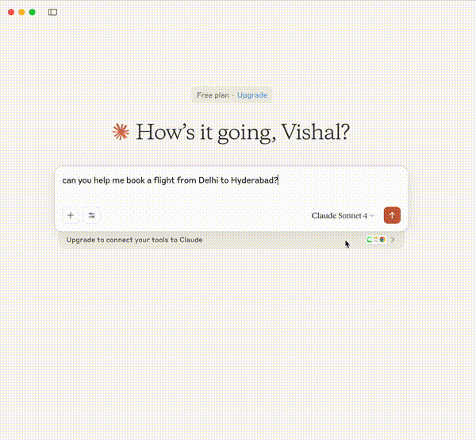
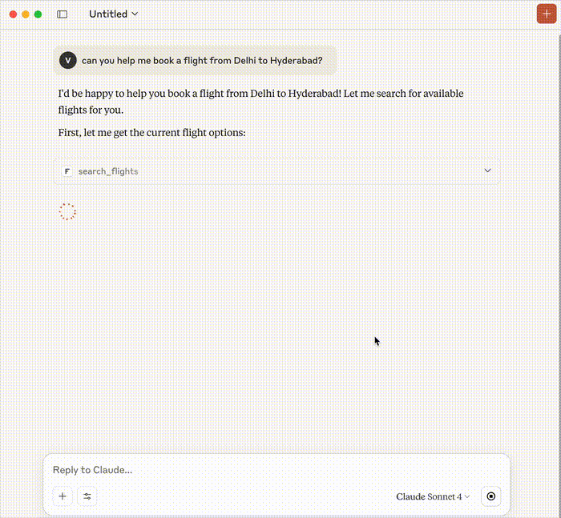
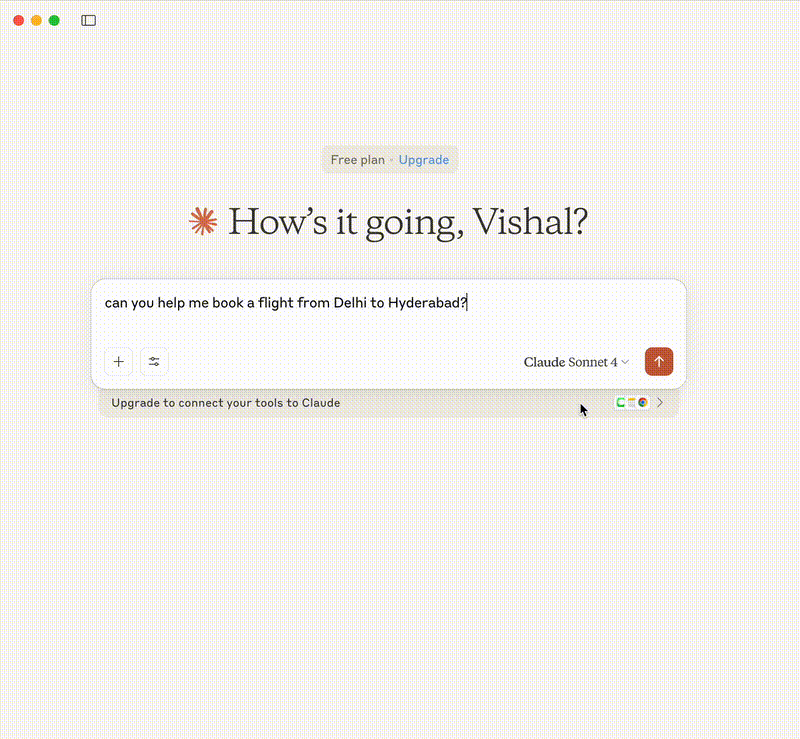

# 🛫 Flight Booking MCP Server

[](./SECURITY.md)
[](./docs/OAUTH_ARCHITECTURE.md)
[](https://python.org)

> **Secure OAuth 2.1 protected Model Context Protocol (MCP) server for flight booking operations**

## 🎥 Demo Video

### MCP with OAuth 2.1 Authentication Demo
[](./mcpWithOAuth2.mov)

*Complete demonstration of MCP server with OAuth 2.1 authentication flow*

### 🎬 Quick Preview (GIF)

*Key moments: OAuth setup → Authentication flow → MCP tool usage*

<details>
<summary>📱 <strong>Alternative Preview Options</strong> (Click to expand)</summary>

| Preview | Size | Duration | Best For |
|---------|------|----------|----------|
|  | 293KB | 15s | Quick overview |
|  | 639KB | 20s | Key features |
|  | 1.1MB | 30s | Detailed walkthrough |

**📥 [Download Full Video: mcpWithOAuth2.mov](./mcpWithOAuth2.mov)** *(Complete 82-second demo)*

</details>

## 🚀 Quick Start

```bash
# 1. Clone and setup
git clone https://github.com/vishalguptahmh/mcp_flight_booking.git
cd mcp_flight_booking

# 2. Environment setup
cp .env.example .env
# Edit .env with your values

# 3. Start OAuth server
.venv/bin/python -m src.flight_booking_mcp.auth.oauth_server

# 4. Start MCP server (in another terminal)
.venv/bin/python -m src.flight_booking_mcp.server
```

## 🔐 Security Features

- ✅ **OAuth 2.1 Authentication** - Industry standard security
- ✅ **JWT Token Validation** - Secure token-based access
- ✅ **Environment Variables** - No hardcoded secrets
- ✅ **GitHub Ready** - Safe for public repositories

## 📱 Screenshots & Demo

### 🎬 Complete Demo Video
> **[📥 Download Demo Video: mcpWithOAuth2.mov](./mcpWithOAuth2.mov)**  
> *Shows: MCP server setup, OAuth 2.1 authentication, and flight booking workflow*

### Key Features Demonstrated
- ✅ **OAuth 2.1 Setup** - Environment configuration and server startup
- ✅ **Authentication Flow** - VS Code popup and browser OAuth flow  
- ✅ **MCP Integration** - Secure tool authentication
- ✅ **Flight Operations** - Search, booking, and user management

### 📸 Screenshots

#### OAuth Authentication

*VS Code-style authentication popup with browser OAuth flow*

#### Flight Search Interface

*Search flights between airports with real-time pricing*

#### Booking Management

*Create and manage flight bookings with confirmation*

## 🛠️ Features

| Feature | Status | Description |
|---------|--------|-------------|
| 🔍 **Flight Search** | ✅ | Search flights between airports |
| 📝 **Create Booking** | ✅ | Book flights with passenger details |
| 📋 **View Bookings** | ✅ | List user's flight reservations |
| 🗺️ **Airport Data** | ✅ | Get available airports and details |
| 🔐 **OAuth 2.1** | ✅ | Secure authentication flow |
| 🎫 **JWT Tokens** | ✅ | Token-based authorization |

## 📁 Project Structure

```
flight_booking_mcp/
├── 🔐 .env.example          # Environment template
├── 📚 docs/                 # Documentation
├── 🏗️ src/flight_booking_mcp/
│   ├── 🔧 auth/            # OAuth 2.1 implementation
│   ├── ⚙️ config/          # Configuration management
│   ├── 🛠️ services/        # Business logic
│   └── 🎯 tools.py         # MCP tools (protected)
└── 🧪 tests/               # Test suites
```

## 🔧 Configuration

### Environment Variables
```bash
# OAuth Server
JWT_SECRET=your-secret-key
OAUTH_SERVER_PORT=9000

# Client Credentials
CLAUDE_DESKTOP_CLIENT_SECRET=your-secret
MCP_CLIENT_SECRET=your-secret
VSCODE_CLIENT_SECRET=your-secret
```

### MCP Client Setup (Claude Desktop)
```json
{
  "mcpServers": {
    "flight-booking": {
      "command": "python",
      "args": ["-m", "flight_booking_mcp.server"],
      "env": {
        "CLIENT_SECRET": "your-claude-desktop-secret"
      }
    }
  }
}
```

## 🔗 API Endpoints

### OAuth Server (Port 9000)
- `GET /` - OAuth login page
- `POST /oauth/token` - Token endpoint
- `GET /.well-known/oauth-authorization-server` - Server metadata
- `GET /.well-known/jwks.json` - JSON Web Key Set

### MCP Tools (Authenticated)
- `search_flights(origin, destination, date)` - 🔐 Search available flights
- `create_booking(flight_id, passenger_name, email)` - 🔐 Book a flight
- `get_user_bookings(email)` - 🔐 Get user's bookings
- `get_available_airports()` - 🔐 List all airports

## 🧪 Testing

```bash
# Run all tests
python -m pytest tests/

# Test OAuth flow
python examples/oauth_client_demo.py

# Test MCP authentication
python examples/test_mcp_auth.py
```

## 📖 Documentation

- 📋 [**OAuth Architecture**](./docs/OAUTH_ARCHITECTURE.md) - Detailed auth flow
- 🔒 [**Security Guide**](./SECURITY.md) - Security setup and best practices
- 🚀 [**Deployment Guide**](./docs/README_OAUTH_DEPLOYMENT.md) - Production deployment

## 🤝 Contributing

1. Fork the repository
2. Create a feature branch: `git checkout -b feature/amazing-feature`
3. Commit changes: `git commit -m 'Add amazing feature'`
4. Push to branch: `git push origin feature/amazing-feature`
5. Open a Pull Request

## 📜 License

This project is licensed under the MIT License - see the [LICENSE](LICENSE) file for details.

## 🏷️ System Info

**System:** VG_FLIGHTMCP_2024  
**Author:** Vishal Gupta  
**Version:** 1.0.0  
**Last Updated:** August 2025

---

<div align="center">

**🛡️ Security First • 🚀 Production Ready • 📱 Developer Friendly**

Made with ❤️ for the MCP community

</div>
